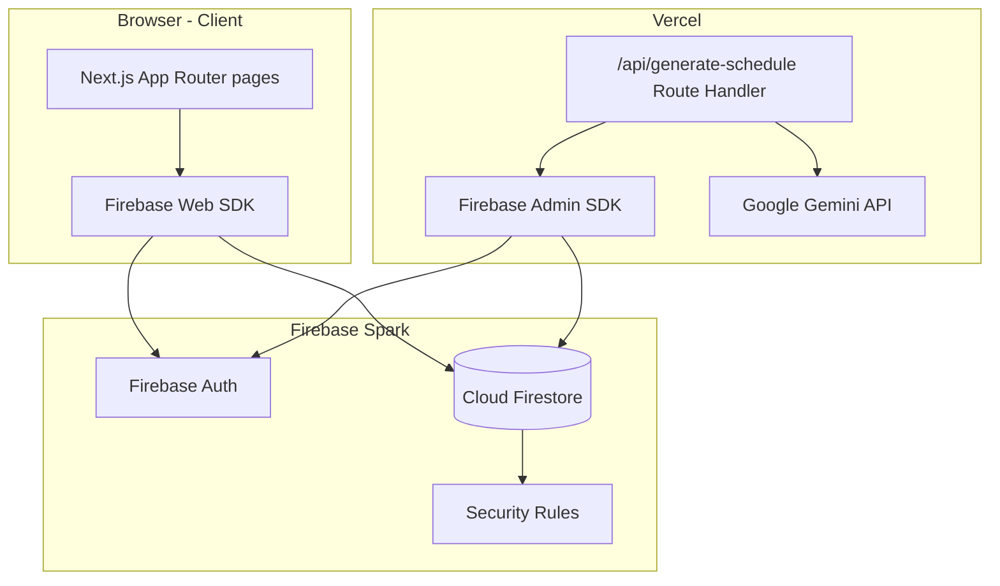
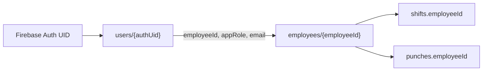
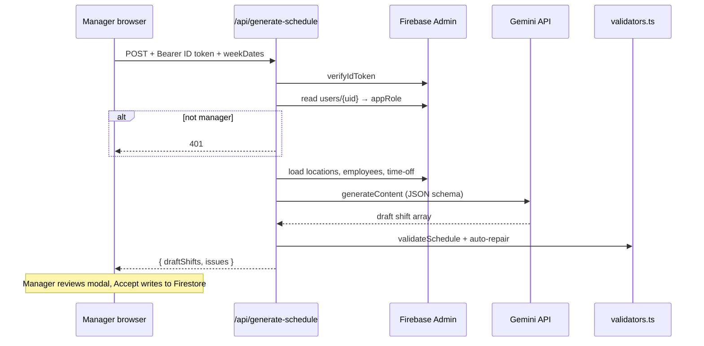
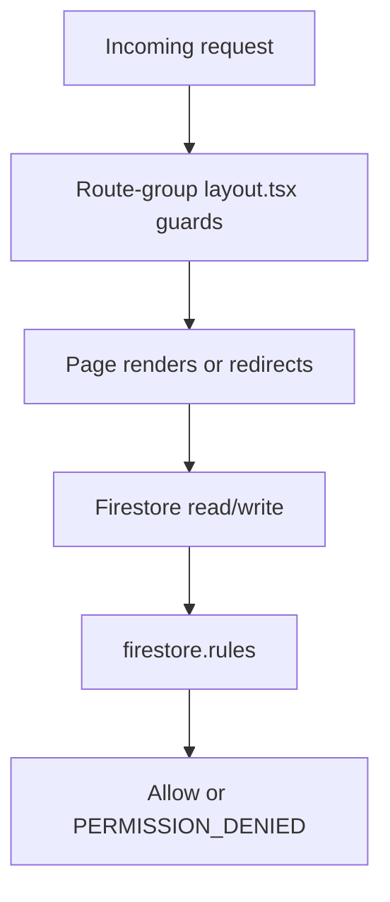

# ShiftWave

Scheduling and timekeeping for a multi-location swim school (~23 staff). ShiftWave replaces When I Work / Teams Shifts for a proof-of-concept demo: employees view schedules, clock in/out with geofencing, view a day-by-day timecard and an estimated paycheck, and submit time-off and swap requests (with an AI-ranked replacement suggestion); managers build schedules, approve requests, review flagged punches, auto-generate or conversationally edit schedules with AI, scan timekeeping data for fraud signals, monitor a live dashboard, and export payroll to Gusto. A site-wide AI assistant answers schedule/hours/pay questions for any signed-in user.

**Live demo:** [shift-wave.vercel.app](https://shift-wave.vercel.app) — see [Architecture & design writeup](docs/ShiftWave_Architecture_Writeup.pdf) for the full design rationale, assumptions, and roadmap.

---

## Table of contents

- [About](#about)
- [Features](#features)
- [Tech stack](#tech-stack)
- [Architecture](#architecture)
- [Navigation guide](#navigation-guide)
- [Getting started](#getting-started)
- [Environment variables](#environment-variables)
- [Firebase setup](#firebase-setup)
- [Scripts](#scripts)
- [Testing](#testing)
- [Security model](#security-model)
- [Assumptions & limitations](#assumptions--limitations)
- [Project structure](#project-structure)
- [Deploy to Vercel](#deploy-to-vercel)
- [Out of scope](#out-of-scope)

---

## About

ShiftWave is a full-stack web app built as a portfolio / POC project. It models real-world scheduling constraints for three pool locations (Arlington, Grand Prairie, Mansfield), remote admin work, and community events. The seeded demo week is **Mon 2026-06-22** — all schedule and clock-in screens default to that week so the demo looks populated regardless of the real calendar date.

Two access roles drive the UI:

| Role | Who | Home route |
|------|-----|------------|
| **Employee** | Instructors, Ambassadors | `/schedule` |
| **Manager** | Schedule admins | `/dashboard` |

Only **two Firebase Auth accounts** exist in the demo (one manager, one instructor). The other ~21 employees are roster records in Firestore — schedulable entities, not logins.

---

## Features

### Employee (any signed-in user)

| Page | Route | What it does |
|------|-------|--------------|
| **My Schedule** | `/schedule` | Real-time list of your shifts for the selected week, grouped by day. "Export to Calendar" downloads an `.ics` file (all upcoming shifts) for one-way import into Google Calendar, Apple Calendar, or Outlook — no OAuth required |
| **Clock In/Out** | `/clock` | Pick a demo-week shift, clock in with geolocation, clock out when done. Geofence + timing status computed client-side; all new punches land as `Needs Review` until a manager approves |
| **Timecard** | `/timecard` | Day-by-day worked-hours breakdown for the selected pay week (Mon–Sun), built from approved punches, with a Regular/Overtime split at 40h |
| **Pay** | `/pay` | Simulated take-home pay for the selected week (gross − flat-rate tax estimate), with a donut chart — explicitly labeled as a demo estimate, not real payroll |
| **Requests** | `/requests` | Submit time-off or shift-swap requests; view history and status. Swap requests include an **AI "Suggest best replacement"** button (see AI features below) |

Managers also use employee pages — they work pool shifts and must be able to clock in.

### Manager only

| Page | Route | What it does |
|------|-------|--------------|
| **Dashboard** | `/dashboard` | KPI cards, coverage and punch-review gauges, hours-per-employee chart, overtime risk, labor-cost estimate, coverage gaps |
| **Schedule Editor** | `/schedule-editor` | Week grid (locations × days), add/edit/delete shifts, live conflict & coverage warnings, AI auto-scheduler, and a natural-language **Copilot** bar for conversational edits |
| **Review Queue** | `/review-queue` | Real-time inbox of flagged punches; one-tap Approve / Reject |
| **Approvals** | `/approvals` | Approve or deny pending time-off and swap requests |
| **Payroll** | `/payroll` | Export Gusto-compatible CSV for approved punches only |
| **Insights** | `/insights` | On-demand AI scan for suspicious timekeeping patterns — geofence-violation clusters and "buddy punching" (see AI features below) |

### Flagship differentiators

1. **AI Auto-Scheduler** — Gemini drafts a one-week schedule; deterministic validators repair ineligible/double-booked assignments; manager reviews and accepts.
2. **Punch Review Queue** — Auto-flagged punches (outside geofence or outside on-time window) with distance readout and one-tap resolution.
3. **Conflict & Coverage Detection** — Live warnings in the editor: double-booking, ineligible location, over-hours, understaffed pool shifts (red cells).
4. **Manager Dashboard** — Hours, overtime risk, labor-cost estimate, coverage gaps from the same validator logic as the editor.

### AI features beyond the brief

Every one of these follows the same rule: **the model never has unchecked authority.** It returns
structured JSON/function-calls that pass through a deterministic validator before a human sees them,
or it answers using only data explicitly handed to it in context — never inventing figures.

| Feature | Where | How it works |
|---------|-------|---------------|
| **Manager Copilot** | `/schedule-editor` bar | Plain-English instructions ("move Avery's Tuesday shift to Thursday") become Gemini function-calls (`add_shift`/`remove_shift`/`reassign_shift`/`move_shift`) scoped to only real IDs in the current week; the result runs through `validateSchedule()` and shows a before/after diff before applying. |
| **Punch Anomaly Detective** | `/insights` | `computeAnomalySignals()` first computes hard facts (geofence violation rate, avg. clock-in delta, "buddy-punch" clusters — ≥2 employees clocking in within 3 minutes of each other, both outside the geofence). Gemini only ranks and explains genuinely concerning patterns, grounded strictly in those numbers. |
| **AI Swap Matchmaker** | `/requests` → Suggest best replacement | `buildSwapCandidates()` scores every coworker on eligibility, projected hours, conflicts, and time-off — all deterministic. Gemini ranks the shortlist and writes a one-line rationale per candidate. |
| **In-app AI Assistant** | site-wide chat widget | Answers "what are my hours this week," "when do I work next," etc., scoped server-side to the signed-in user's own data only. Can compute simulated take-home pay live using the same formula as `/pay`. Resets on account switch so sessions never leak across users. |
| **Calendar export** | `/schedule` → Export to Calendar | Not Gemini-powered, but Google-ecosystem-aligned: downloads a standards-compliant `.ics` file of all upcoming shifts for one-tap import into Google Calendar — no OAuth required. |

### App polish

- **Dark / light mode** — Toggle in the top nav (persisted in `localStorage`, respects system preference on first visit).
- **PWA** — Installable via web manifest + network-first no-op service worker (no offline caching).
- **Responsive** — Schedule editor grid scrolls horizontally on mobile; dashboard gauges stack vertically.

---

## Tech stack

| Layer | Choice | Notes |
|-------|--------|-------|
| Framework | **Next.js 16** (App Router) + **TypeScript** | Server Route Handlers keep secrets server-side |
| Styling | **Tailwind CSS v4** | `@import "tailwindcss"` — no `tailwind.config.js` |
| Auth & DB | **Firebase Auth** + **Cloud Firestore** | Spark (free) tier |
| Server SDK | **Firebase Admin SDK** | Token verification + AI route reads |
| AI | **Google Gemini** (`gemini-2.5-flash`) via `@google/genai` | Server-only; JSON structured output |
| Charts | **recharts** | Dashboard bar chart and gauges |
| Data import | **xlsx** (SheetJS) | One-off seed script |
| Hosting | **Vercel Hobby** | Auto-deploy from GitHub |

**Cost target:** ~$0 — Firebase Spark + Vercel Hobby + Gemini free tier. No Cloud Functions, no Firebase App Hosting (both require Blaze billing).

**Gemini model note:** `gemini-2.5-flash` is current as of deploy. Google has announced earliest shutdown **2026-10-16**; the model ID is isolated in `src/app/api/generate-schedule/route.ts` as `GEMINI_MODEL` — a future swap (e.g. to `gemini-3.5-flash`) is a one-line change.

---

## Architecture

### High-level system diagram



### Identity model

Login identity and employee roster are **separate collections**:



- `users/{authUid}` — written by `scripts/link-users.mjs`; `appRole` is **not** a token claim — server routes and security rules read it from Firestore.
- `employees/{I001}` — roster from the Excel import; referenced by shifts and punches.

### Request flow — AI scheduler



### Access control layers



1. **UI guards** — `(manager)/layout.tsx` requires `appRole === 'manager'`; `(employee)/layout.tsx` requires any signed-in user.
2. **Firestore rules** — Real backstop; identity resolved via `users/{request.auth.uid}` and `isManager()` helper.
3. **API route** — AI endpoint verifies ID token + reads `users/{uid}` for manager role.

### Shared validator module

Conflict and coverage logic lives once in `src/lib/validators.ts` as pure functions (no Firebase imports). Reused by:

- Schedule editor (live warnings)
- AI scheduler (post-generation repair)
- Dashboard (coverage gaps, overtime)

---

## Navigation guide

After sign-in, you land on your role home:

| Role | Default redirect |
|------|------------------|
| Manager | `/dashboard` |
| Employee | `/schedule` |

**Top navigation** (always visible when signed in):

```
[ShiftWave]  Schedule | Clock In/Out | Timecard | Pay | Requests | Dashboard | Editor | Review Queue | Approvals | Payroll | Insights     [theme toggle] [name] [Sign out]
             └────────────── employee links ──────────────┘  └──────────────────────── manager-only ────────────────────────┘
```

A chat-bubble **AI Assistant** widget floats over every page for any signed-in user.

- **Review Queue** shows a red badge with the count of punches needing review (managers only).
- **Theme toggle** — sun/moon pill switch on the right, before your name.
- **Demo week** — Schedule, Clock, Timecard, Pay, Dashboard, Editor, and Payroll pages include a "Demo week" button that jumps to the week of 2026-06-22.

**Typical manager workflow:**

1. Open **Dashboard** → scan coverage gaps and punches needing review.
2. **Schedule Editor** → fix understaffed cells, run **Generate week with AI**, or type an instruction into the **Copilot** bar.
3. **Review Queue** → approve/reject flagged punches.
4. **Insights** → run an AI scan for buddy-punching / geofence-fraud patterns.
5. **Approvals** → resolve time-off and swap requests.
6. **Payroll** → export approved hours as Gusto CSV.

**Typical employee workflow:**

1. **Schedule** → confirm upcoming shifts, export to Google Calendar.
2. **Clock In/Out** → select a shift, allow location, clock in/out.
3. **Timecard / Pay** → check worked hours and an estimated paycheck.
4. **Requests** → submit time-off, or propose a swap with an AI-suggested replacement.

---

## Getting started

### Prerequisites

- **Node.js 20.6+** (for `--env-file` in seed scripts)
- A **Firebase project** on the Spark (free) plan
- A **Gemini API key** ([Google AI Studio](https://aistudio.google.com))

### Local development

```bash
git clone https://github.com/Avirup26/ShiftWave.git
cd ShiftWave
npm install
cp .env.example .env.local
# Fill in .env.local (see Environment variables)
npm run dev
```

Open [http://localhost:3000](http://localhost:3000).

### Seed Firestore (first time)

```bash
# Import locations, employees, roles, shifts, punches from the demo workbook
node --env-file=.env.local scripts/import-sample-data.mjs

# After creating the 2 Auth accounts in Firebase Console:
node --env-file=.env.local scripts/link-users.mjs
```

### Build

```bash
npm run build   # must pass before every commit
npm start       # production server locally
npm test        # unit tests: Gusto export, anomaly signals, swap matching, .ics calendar export
```

---

## Environment variables

Copy `.env.example` to `.env.local` (gitignored). Set the same values in Vercel before deploy.

| Variable | Scope | Description |
|----------|-------|-------------|
| `NEXT_PUBLIC_FIREBASE_API_KEY` | Public (client) | Firebase web config |
| `NEXT_PUBLIC_FIREBASE_AUTH_DOMAIN` | Public | |
| `NEXT_PUBLIC_FIREBASE_PROJECT_ID` | Public | |
| `NEXT_PUBLIC_FIREBASE_STORAGE_BUCKET` | Public | |
| `NEXT_PUBLIC_FIREBASE_MESSAGING_SENDER_ID` | Public | |
| `NEXT_PUBLIC_FIREBASE_APP_ID` | Public | |
| `FIREBASE_ADMIN_SERVICE_ACCOUNT` | **Server only** | Full service-account JSON as one line; `\n` in `private_key` stays escaped |
| `GEMINI_API_KEY` | **Server only** | Google AI Studio key |
| `TEST_MANAGER_EMAIL` | Scripts | Email for manager test account |
| `TEST_INSTRUCTOR_EMAIL` | Scripts | Email for instructor test account |

Never prefix secrets with `NEXT_PUBLIC_`. Never commit `.env.local`.

---

## Firebase setup

1. Create a Firebase project (Spark plan, no billing card required).
2. Enable **Email/Password** authentication.
3. Create **Firestore** database.
4. Create two Auth users (manager + instructor) matching `TEST_MANAGER_EMAIL` / `TEST_INSTRUCTOR_EMAIL`.
5. Generate a **service account key** (Project settings → Service accounts → Generate new private key). Paste the JSON as a single-line string into `FIREBASE_ADMIN_SERVICE_ACCOUNT`.
6. Run seed scripts (see [Getting started](#getting-started)).
7. Deploy security rules:

```bash
firebase deploy --only firestore:rules
```

Verify rules in Firebase Console → Firestore → Rules → Rules Playground.

---

## Scripts

| Script | Command | Purpose |
|--------|---------|---------|
| Dev server | `npm run dev` | Hot reload at localhost:3000 |
| Build | `npm run build` | Production build + typecheck |
| Lint | `npm run lint` | ESLint |
| Test | `npm test` | Gusto CSV overtime split, anomaly signals, swap matching, `.ics` export |
| Import data | `node --env-file=.env.local scripts/import-sample-data.mjs` | xlsx → Firestore |
| Link users | `node --env-file=.env.local scripts/link-users.mjs` | Auth UID → `users/{uid}` docs |

---

## Testing

```bash
npm test
```

Runs `src/lib/gusto.test.ts` (40h/week regular/overtime split on unrounded minutes), `anomalies.test.ts`, `swapMatch.test.ts`, and `ics.test.ts` (RFC 5545 structure + line folding for the calendar export). All pure-function modules — no Firebase, no network, no Gemini calls in tests.

Manual smoke tests before demo:

- [ ] Instructor login → `/schedule`, `/clock`, `/timecard`, `/pay`, `/requests` work; `/dashboard` redirects to `/schedule`
- [ ] Manager login → all pages accessible; review queue badge updates live
- [ ] Clock-in outside geofence → punch appears in review queue
- [ ] AI scheduler → non-manager gets 401; manager gets draft + issues modal
- [ ] Copilot → a plain-English instruction produces a sensible diff; nonsense input degrades gracefully
- [ ] Insights → scan completes and only flags employees with real signal
- [ ] Swap request → "Suggest best replacement" returns ranked, eligible candidates
- [ ] AI Assistant → answers an hours/pay question using only the signed-in user's own data
- [ ] Schedule → "Export to Calendar" downloads a valid `.ics` that imports into Google Calendar with correct times
- [ ] Payroll export → only `Approved` punches; excluded list links to review queue
- [ ] Theme toggle persists across refresh

---

## Security model

Firestore rules (`firestore.rules`) enforce:

| Collection | Read | Write |
|------------|------|-------|
| `users/{uid}` | Own doc or manager | Admin SDK only |
| `employees`, `locations`, `roles`, `shifts` | Any signed-in user | Manager only |
| `punches` | Own punches or manager (all) | Create own (no `Approved` on create); update own except `managerReviewStatus`; manager updates all |
| `timeOffRequests` | Own or manager | Create own; manager updates status |
| `swapRequests` | From/to employee or manager | Create as requester; manager updates status |

Employee-facing queries are scoped to `where('employeeId', '==', ownId)` so list reads match per-doc rules.

---

## Assumptions & limitations

- **Two app roles:** `manager` and `employee` (Ambassadors + Instructors are employees).
- **Weekly pay period:** Mon–Sun; overtime = hours over 40/week (FLSA/TX assumption).
- **Geofence:** 200 ft pools, 300 ft events, none for remote; on-time window = 5 min (reverse-engineered from seed data).
- **Client-side geofencing:** POC only — production would validate server-side + App Check.
- **Hourly pay rates:** Assumed in `constants.ts`; used only for dashboard labor-cost **estimate**, not payroll export.
- **Demo week:** Fixed to week of 2026-06-22; clock page shows demo-week shifts, not filtered to real "today".
- **Events (EVT):** No per-event coordinates in POC — event clock-ins treated as `No Geofence`.
- **PTO:** Approved time off tracked in Approvals; not included in the Gusto worked-hours CSV (separate PTO import out of scope).
- **Only manager-approved punches** count toward payroll export.
- **New punch create:** Always `Needs Review`; manager must approve (integrity gate). Seeded punches retain their original statuses.
- **Gemini model:** `gemini-2.5-flash` — earliest announced shutdown 2026-10-16.

---

## Project structure

```
/
├── PLAN.md                 # Build spec (source of truth for phases)
├── firestore.rules         # Firestore security rules
├── data/
│   └── scheduling_timekeeping_demo_sample_data.xlsx
├── docs/
│   └── ShiftWave_Architecture_Writeup.pdf   # Architecture, AI features, assumptions, roadmap
├── scripts/
│   ├── import-sample-data.mjs
│   └── link-users.mjs
├── public/
│   └── sw.js               # PWA service worker (network-only, no cache)
└── src/
    ├── app/
    │   ├── (employee)/     # /schedule, /clock, /timecard, /pay, /requests
    │   ├── (manager)/      # /dashboard, /schedule-editor, /review-queue, /approvals, /payroll, /insights
    │   ├── api/
    │   │   ├── generate-schedule/   # AI auto-scheduler
    │   │   ├── copilot/             # Natural-language schedule edits (function-calling)
    │   │   ├── punch-anomalies/     # Anomaly Detective
    │   │   ├── swap-suggestions/    # AI Swap Matchmaker
    │   │   └── assistant/           # Site-wide chat assistant
    │   ├── login/
    │   ├── layout.tsx
    │   ├── manifest.ts     # PWA manifest
    │   └── icon.tsx        # App icon (ImageResponse)
    ├── components/         # TopNav, ThemeToggle, AssistantWidget, CopilotPanel, charts, gauges, modals, …
    └── lib/
        ├── auth.tsx        # Auth context + role resolution
        ├── theme.tsx       # Dark/light mode context
        ├── constants.ts    # Coverage rules, geofence, pay rates
        ├── types.ts        # Data model types
        ├── validators.ts   # Conflict & coverage (pure functions)
        ├── geofence.ts      # Haversine + timing
        ├── gusto.ts        # Payroll CSV builder
        ├── ics.ts          # Google/Apple/Outlook calendar (.ics) builder
        ├── anomalies.ts    # Punch anomaly signal computation
        ├── swapMatch.ts    # Swap-candidate scoring
        ├── copilot.ts      # Copilot function-call → schedule-op resolver
        ├── pay.ts / payHours.ts   # Simulated pay & hours math
        ├── weekHelpers.ts
        ├── gemini.ts       # Gemini client + model constant
        ├── apiAuth.ts      # Shared API route auth helpers
        ├── firebase.client.ts
        └── firebase.admin.ts
```

---

## Deploy to Vercel

The live demo runs at [shift-wave.vercel.app](https://shift-wave.vercel.app), auto-deployed from `main`. To deploy your own instance:

1. Push to GitHub (Vercel auto-deploys on push to `main`).
2. In Vercel project settings → **Environment Variables**, set all vars from [Environment variables](#environment-variables).
3. Confirm Firebase Auth accounts exist and `users/{uid}` docs are linked.
4. Deploy Firestore rules: `firebase deploy --only firestore:rules`.
5. Open the live URL in incognito; sign in with both test accounts.

**Vercel Hobby limits (relevant):** 100 GB bandwidth/month, 100 build minutes/month — sufficient for this POC.

**Firebase Spark limits (relevant):** 1 GB storage, 50K reads/day, 20K writes/day — sufficient for demo traffic.

---

## Out of scope

What would come next in a production version:

- Server-side geofence validation + App Check (anti-spoofing)
- Push / email notifications
- Google SSO
- Two-way Google Sheets / Calendar **sync** (live, OAuth-based) — a one-way Google Calendar **export** (`.ics` download from `/schedule`) already ships; see [Features](#features)
- Recurring shift templates
- Audit log + payroll-period locking
- Direct Gusto API integration
- Native mobile wrapper for background geofencing

---

## License

Private / portfolio project. Demo data in `data/` is synthetic sample data, safe to commit.
